# ***CONFIGURABLE CACHE***
# Configurable Cache (SystemVerilog Implementation)

> **Parametric, synthesizable cache design with configurable associativity, block size, and replacement policies for learning and embedded systems.**

🗓️ Last updated: July 22, 2025  
© 2025 Maktab-e-Digital Systems Lahore. Licensed under the Apache 2.0 License.

---


## **PROJECT OVERVIEW**:
This project implements a direct-mapped cache,2-way set associative cache,4-way set associative cahe and configurable (n-way)set associative cache controller with support for basic memory transactions. It simulates how a CPU communicates with memory via a cache to reduce access latency and improve performance. 

## OBJECTIVE:
The primary objectives of this project are:

1. **Design a Configurable Cache Architecture**: 
To build a cache system that is modular and configurable, supporting different associativity levels:

- Direct-mapped cache

- 2-way set associative cache

- 4-way set associative cache
- n-way set associative cache

2. **Explore Cache Organization Techniques**: 
To understand and implement multiple cache configurations, comparing their behavior and performance in handling memory access patterns.

3. **Implement Cache Controller Using FSM-Based Logic**: 
To develop a finite state machine (FSM) that manages cache operations such as:

- Cache hit/miss detection

- Block replacement (e.g., using LRU for set-associative caches)

- Write-back of dirty blocks

- Memory refill and synchronization with main memory

- Support Both Read and Write Accesses with Replacement Policies
To implement logic that handles:

- Read and write requests from a simulated CPU

- Write-back on dirty evictions

- Write-allocate and read-allocate refill policies

- LRU replacement policy in associative caches

## ***OUR STRATEGY***:
We decided to move from basic fundamentals to higher level. So, we implemented a direct mapped cache first. Then we will move our approach to set associative cache mapping.

  ### For Testing:
      We started from testing our rtl module by module to check their functionality and then we integrated  all the modules later tested them again for each cache starting from direct mapped cache.

## ***DIRECT MAPPED CACHE***:
 #### **What is a cache?**
In modern computer systems, cache memory serves as a small, fast memory layer between the CPU and the slower main memory (RAM). It stores frequently accessed data and instructions to reduce access latency and improve overall system performance.

- When the CPU needs data, it first checks the cache:

- If the data is found, it’s a cache hit (faster access).

- If not, it’s a cache miss, and the data is fetched from main memory and placed in the cache.

####  **Types of Cache Mapping**:
There are three primary techniques to map memory blocks to cache lines:

- Direct-Mapped Cache: 
Each memory block maps to exactly one cache line.
It is  Simple and fast but there is Higher chance of conflict misses.

- Fully Associative Cache: 
Any memory block can go into any cache line. It is Very flexible
but Expensive and slower to implement (requires searching all tags)

- Set-Associative Cache: 
A compromise between the above two: the cache is divided into sets, and each set has multiple ways (lines). It Balances between cost and flexibility and  is Slightly more complex than direct-mapped

### **What is a Direct-Mapped Cache?**
A direct-mapped cache maps each memory block to exactly one cache line using the index bits derived from the memory address. 

### **Specifications of Our Direct-Mapped Cache:**
Our first implementation is a direct-mapped cache with the following configuration:

| **Parameter**       | **Value**             |
|---------------------|------------------------|
| Cache Size          | 1 KB (1024 bytes)      |
| Block Size          | 128 bits (16 bytes)    |
| Line Size           | 64 lines               |
| Tag Bits            | 24 bits                |
| Valid Bit           | 1 bit                  |
| Dirty Bit           | 1 bit                  |
| Total Bits/Line     | 154 bits               |  

## **TOP LEVEL DIAGRAM**:

<div align="center">
  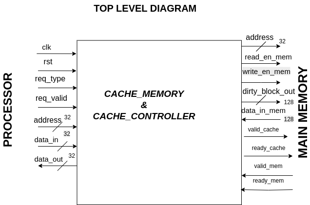
</div>


## **Inputs:**
| **Signal**    | **Width** | **Direction** | **Description**                           |
|---------------|-----------|---------------|-------------------------------------------|
| `req_type`    | 1 bit     | Input         | Request type: `0` = Read, `1` = Write     |
| `req_valid`   | 1 bit     | Input         | Indicates a valid request from CPU        |
| `address`     | 32 bits   | Input         | Address for read/write operation          |
| `data_in`     | 32 bits   | Input         | Data input from CPU (for writes)          |
| `data_out`    | 32 bits   | Output        | Data output to CPU (for reads)            |
| `data_in_mem` | 128 bits  | Input         | Cache line (block) fetched from memory    |
| `clk`         | 1 bit     | Input         | Clock signal                              |
| `rst`         | 1 bit     | Input         | Reset signal                              |

## **Outputs:**
| **Signal**        | **Width** | **Direction** | **Description**                                      |
|--------------------|-----------|---------------|------------------------------------------------------|
| `req_type`        | 1 bit     | Output        | Pass-through or processed request type (read/write)  |
| `address`         | 32 bits   | Output        | Address to memory or next stage                      |
| `dirty_blockout`  | 128 bits  | Output        | Dirty block sent to memory if eviction occurs        |

  

  

## **DataPath**
<div align="center">
  
</div>


###  Datapath (Brief)


<div align="center">
  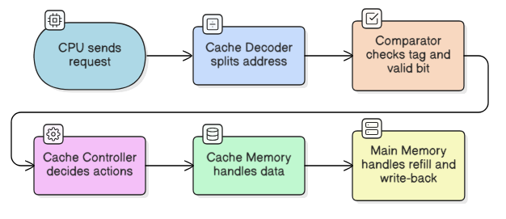
</div>

- CPU sends `req_valid`, `req_type`, `address [31:0]`, `data_in [31:0]` (for writes).
- **Cache Decoder** splits the address into `tag`, `index`, `block offset`.
- **Comparator** checks if the `tag` matches and valid bit is set, generating `hit`.
- **Cache Controller**:
  - Decides actions based on `hit`, `dirty_bit`, `req_type`, `ready_mem`.
  - Generates control signals (`read_en_cache`, `write_en_cache`, `refill`, etc.).
- **Cache Memory**:
  - **Read hit**: sends `data_out [31:0]` to CPU.
  - **Write hit**: updates the block and sets dirty bit.
  - **Miss**: may write back dirty block (`dirty_block_out [127:0]`) and refill (`data_in_mem [127:0]`).
- **Main Memory** provides/accepts 128-bit blocks for refill or write-back using handshake signals.


  ## ⚙️ Module-by-Module Explanation

### 1️⃣ `cache_decoder`
<div align="center">
  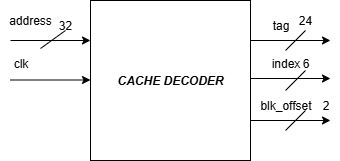
</div>


- **Inputs**: `clk`, `address [31:0]`
- **Outputs**: 
  - `tag [23:0]`
  - `index [5:0]`
  - `blk_offset [1:0]`
- **Function**: Splits the 32-bit CPU address into:
  - `tag` (upper bits) for comparison
  - `index` to locate the cache line
  - `block offset` to select the word in the block

---


### 2️⃣ `cache_controller`
div align="center">
  
</div>


- **Inputs**:  
  - `clk`, `rst`  
  - `req_valid`, `req_type` (0 = read, 1 = write)  
  - `hit`, `dirty_bit`  
  - `req_ready_mem`, `resp_valid_mem`  

- **Outputs**:  
  - **Main Memory Interface**:  
    - `req_valid_mem`, `resp_ready_mem`, `read_en_mem`, `write_en_mem`  
  - **Cache Interface**:  
    - `read_en_cache`, `write_en_cache`, `write_en`, `refill`, `done_cache`

- **Function**:  
  - Implements FSM with the following states:  
    `IDLE`, `COMPARE`, `WRITE_BACK`, `WAIT_ALLOCATE`, `WRITE_ALLOCATE`, `REFILL_DONE`
  - On **read/write hit**: allows CPU to complete operation directly.
  - On **miss**:
    - If **clean**: refills cache from memory.
    - If **dirty**: writes back to memory first, then refills.
  - `WAIT_ALLOCATE` provides a separation cycle between memory write and read.

---

##  FSM Explanation — Cache Controller

| **State**         | **Conditions**                                  | **Next State**        | **Actions**                                                          |
|-------------------|--------------------------------------------------|------------------------|----------------------------------------------------------------------|
| **IDLE**          | `req_valid = 1`                                  | `COMPARE`              | Wait for valid CPU request                                           |
| **COMPARE**       | `hit = 1`                                        | `IDLE`                 | Complete read/write, assert `done_cache`                            |
|                   | `!hit & !dirty_bit`                              | `WRITE_ALLOCATE`       | Clean miss: proceed to refill                                       |
|                   | `!hit & dirty_bit`                               | `WRITE_BACK`           | Dirty miss: write back required                                     |
| **WRITE_BACK**    | `req_ready_mem = 1`                              | `WAIT_ALLOCATE`        | Issue write-back to memory                                          |
| **WAIT_ALLOCATE** | (1-cycle wait after write-back)                  | `WRITE_ALLOCATE`       | Prevent overlap between write-back and refill request               |
| **WRITE_ALLOCATE**| `resp_valid_mem = 1`                             | `REFILL_DONE`          | Request memory read, refill cache when data arrives                 |
| **REFILL_DONE**   | -                                                | `IDLE`                 | Finalize refill; if write requested, perform CPU write after refill |

---

###  Key Points

- `WAIT_ALLOCATE` ensures **clean separation** between write-back and memory read (refill).
- `write_en_mem` is asserted only **during `WRITE_BACK`** when memory is ready.
- `read_en_mem` is asserted **during `WRITE_ALLOCATE`** when memory is ready.
- `write_en_cache` is used:
  - For **CPU write** in `COMPARE` (on hit) or in `REFILL_DONE` (after refill).
  - For **writing refill data** during `WRITE_ALLOCATE`.
- `done_cache` is asserted in `COMPARE` (on hit) and `REFILL_DONE`.


### 3️⃣ `cache_memory`
<div align="center">
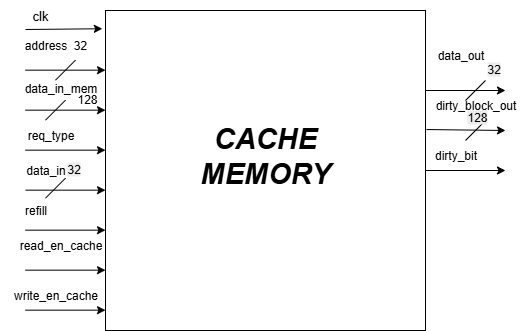
</div>


- **Inputs**:
  - `clk`, `tag`, `index`, `blk_offset`
  - `req_type`, `read_en_cache`, `write_en_cache`
  - `ready_mem`, `data_in_mem [127:0]`, `data_in [31:0]`
- **Outputs**:
  - `data_out [31:0]` (to CPU)
  - `dirty_block_out [127:0]` (to memory on write-back)
  - `dirty_bit`, `hit`, `done_cache`
- **Function**:
  - On **read hit**: sends required word to CPU.
  - On **write hit**: updates the word in the cache and sets the dirty bit.
  - On **miss**:
    - Provides dirty block if necessary.
    - Accepts new block from memory on refill.
   
      


  ###  comparator 

  - Compares `tag` from CPU with stored `tag` in cache at `index`.
  - Checks valid bit.
  - **Outputs `hit` signal** if there is a valid match.


   ###  main_memory (abstract, if implemented)
  - Simulated using   random contents for testing.

---
### 🧾 Header File for Cache Specifications

A header file (`cache_defs.sv`) has been added to centralize the cache controller's specifications. It includes:

- FSM state definitions using `typedef enum`.
- Common parameters for consistency.
- Shared signal names and interface conventions.

🔧 **Purpose**: Improves modularity, avoids code duplication, and simplifies updates across modules.


## Testbenches
##  `cache_decoder_tb` Testbench

### 📌 Purpose

This testbench verifies the **`cache_decoder` module** by:

 Checking **correct extraction** of:
- **Tag** (bits [31:8])
- **Index** (bits [7:2])
- **Block Offset** (bits [1:0])

from a **32-bit address**, ensuring your cache’s address decoding logic is functioning correctly before integrating into the full cache pipeline.

###  Test Cases: 

### Basic Extraction Test

**Purpose:**  
To verify that `cache_decoder` correctly extracts **Tag, Index, and Block Offset** fields from a given 32-bit address.

#### 🛠 Inputs

| Signal   | Value                                                   |
|----------|----------------------------------------------------------|
| `address` | `32'b11011110101011011011111011101111` |

###  Expected Output:

---
#  Testbench: `tb_cache_controller_all_cases`

This SystemVerilog testbench is designed to **verify the behavior of a `cache_controller` module** under a comprehensive set of scenarios covering read and write requests, cache hits, and cache misses (both clean and dirty).

## 📌 Purpose

The main objective of this testbench is to validate that the `cache_controller` FSM transitions through all relevant states correctly and produces the expected control signals based on various cache request conditions.

It tests the controller under **six different scenarios**, checking state transitions and output signals for correctness.

---

## 🔌 DUT Interface

###  Inputs
| Signal         | Description                                    |
|----------------|------------------------------------------------|
| `clk`          | Clock signal (10ns period)                     |
| `rst`          | Reset signal (active high)                     |
| `req_valid`    | Cache request validity flag                    |
| `req_type`     | Type of request: `0 = Read`, `1 = Write`       |
| `hit`          | Indicates whether requested data is in cache   |
| `dirty_bit`    | Indicates if the cache block is dirty          |
| `req_ready_mem`| Main memory ready to receive request           |
| `resp_valid_mem`| Memory response is ready                      |

###  Outputs
| Signal            | Description                                   |
|-------------------|-----------------------------------------------|
| `req_valid_mem`   | Indicates if memory request is being sent     |
| `resp_ready_mem`  | Controller ready to accept memory response    |
| `read_en_mem`     | Read enable signal to memory                  |
| `write_en_mem`    | Write enable signal to memory                 |
| `read_en_cache`   | Read enable signal for cache                  |
| `write_en_cache`  | Write enable signal for cache                 |
| `write_en`        | Write enable (generic)                        |
| `refill`          | Signals when block is refilled from memory    |
| `done_cache`      | Indicates cache transaction is completed      |

---

##  Test Cases

Each test case triggers different controller states and prints internal FSM state and relevant I/O signals.

###  Test 1: Read Hit
- **Inputs:** `req_valid=1`, `req_type=0`, `hit=1`, `dirty_bit=0`
- **Expected:** Controller serves request directly from cache (`read_en_cache=1`), transitions to `IDLE`.

###  Test 2: Write Hit
- **Inputs:** `req_valid=1`, `req_type=1`, `hit=1`, `dirty_bit=0`
- **Expected:** Write directly to cache (`write_en_cache=1`), then return to `IDLE`.

###  Test 3: Read Miss (Clean)
- **Inputs:** `req_valid=1`, `req_type=0`, `hit=0`, `dirty_bit=0`
- **Expected FSM States:**
  - `COMPARE` → `WRITE_ALLOCATE` → wait for `resp_valid_mem` → `REFILL_DONE` → `IDLE`

### Test 4: Read Miss (Dirty)
- **Inputs:** `req_valid=1`, `req_type=0`, `hit=0`, `dirty_bit=1`
- **Expected FSM States:**
  - `COMPARE` → `WRITE_BACK` → `WAIT_ALLOCATE` → `WRITE_ALLOCATE` → `REFILL_DONE` → `IDLE`

###  Test 5: Write Miss (Clean)
- **Inputs:** `req_valid=1`, `req_type=1`, `hit=0`, `dirty_bit=0`
- **Expected FSM States:**
  - `COMPARE` → `WRITE_ALLOCATE` → `REFILL_DONE` → `IDLE`

###  Test 6: Write Miss (Dirty)
- **Inputs:** `req_valid=1`, `req_type=1`, `hit=0`, `dirty_bit=1`
- **Expected FSM States:**
  - `COMPARE` → `WRITE_BACK` → `WAIT_ALLOCATE` → `WRITE_ALLOCATE` → `REFILL_DONE` → `IDLE`

---


##  Expected Output

### Read Hit:


<div align="center">
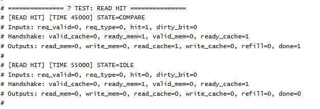
</div>

### Write hit:

<div align="center">
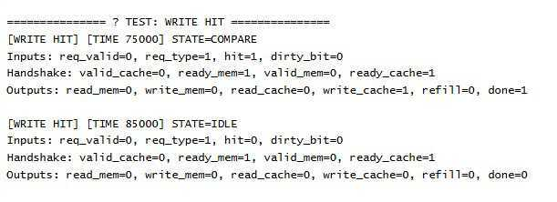
</div>


### Read Miss Clean:

<div align="center">
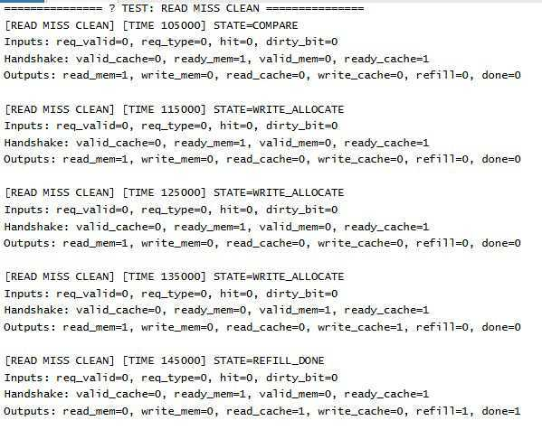
</div>

### Read Miss Dirty:

<div align="center">
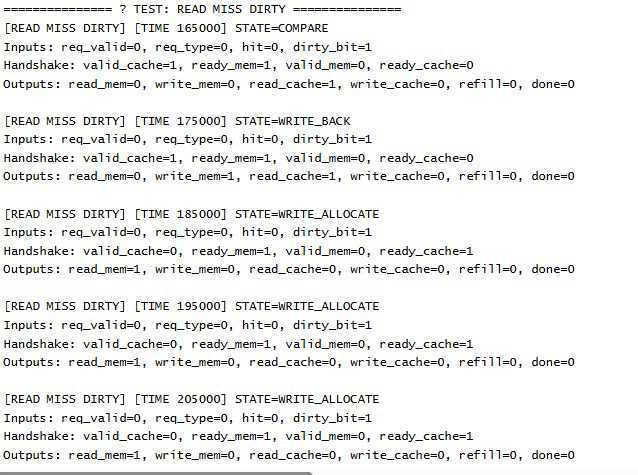
</div>

### Write Miss CLean:

<div align="center">
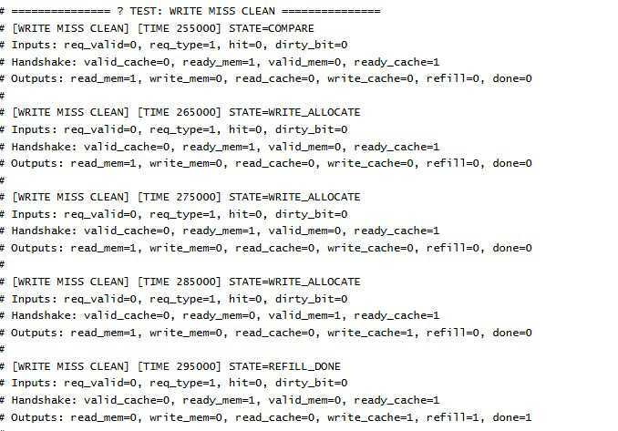
</div>

### Write Miss Dirty:

<div align="center">
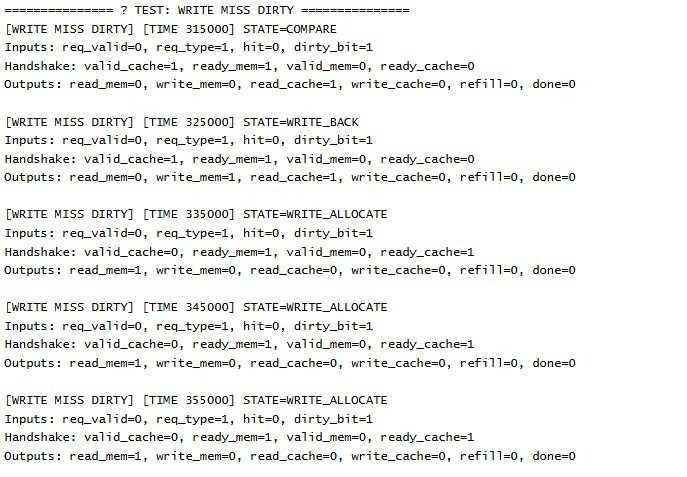
</div>

### Snippet of Waves from Simulation:

<div align="center">
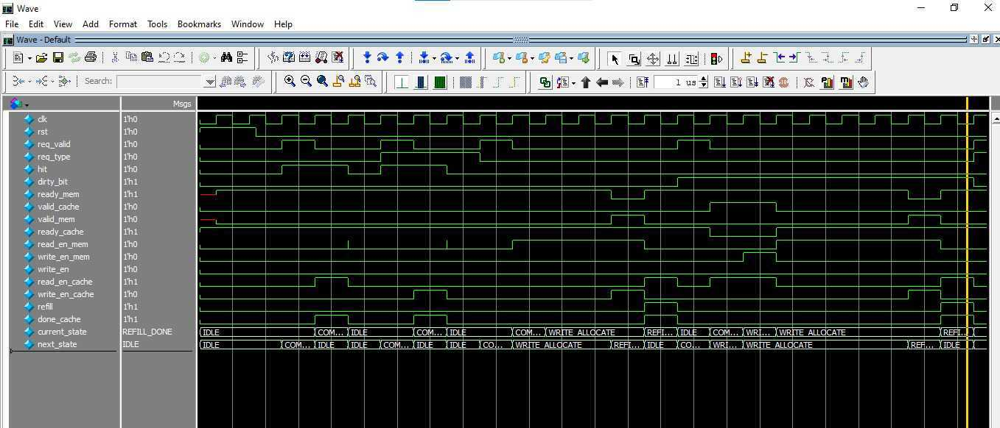
</div>


 


---
#  Testbench: `cache_tb`

This SystemVerilog testbench is built to **verify and validate the functionality of the `cache_memory` module**, which simulates the data-handling behavior of a cache memory unit. It rigorously exercises read and write operations in both hit and miss scenarios, with detailed inspection of dirty bit behavior and memory refill.

---

##  Purpose

- To simulate and verify the correct behavior of the **cache memory unit** in handling various types of requests.
- To observe cache hits, misses (both clean and dirty), evictions, and refills from main memory.
- To check the internal structure of the cache, including **data storage**, **dirty bit updates**, and **data evictions**.

---

## 🔌 DUT Interface

###  Inputs

| Signal           | Description                                                         |
|------------------|---------------------------------------------------------------------|
| `clk`            | Clock signal (10ns period)                                          |
| `tag`            | Tag portion of the memory address                                   |
| `index`          | Index to select a specific cache block                              |
| `blk_offset`     | Offset to select word inside a block                                |
| `req_type`       | 0 = Read, 1 = Write                                                 |
| `read_en_cache`  | Enable signal for read operation                                    |
| `write_en_cache` | Enable signal for write operation                                   |
| `refill`         | Signal to trigger block refill from memory                          |
| `data_in_mem`    | Data coming from memory to cache (used during refill)               |
| `data_in`        | Word-level data input for write operations                          |

###  Outputs

| Signal             | Description                                                       |
|--------------------|-------------------------------------------------------------------|
| `data_out`         | Output word read from cache                                       |
| `hit`              | 1 if the cache access was a hit, 0 if it was a miss              |
| `dirty_bit`        | Indicates if the cache block has been modified                   |
| `dirty_block_out`  | Full block to be written back to memory on dirty eviction        |
| `done_cache`       | Operation done flag (optional usage)

---

##  Test Cases

The testbench runs a comprehensive set of operations designed to test key cache behaviors:

###  1. **Read Hit**
- **Setup:** Tag/index matches an initialized cache entry.
- **Action:** `read_en_cache = 1`
- **Expected:** `hit = 1`, `data_out` returns correct word, `dirty_bit` remains unchanged.

---

###  2. **Write Hit**
- **Setup:** Tag/index matches valid entry, write to word.
- **Action:** `write_en_cache = 1`, provide `data_in`.
- **Expected:** `hit = 1`, data updated in cache, `dirty_bit = 1`.

---

###  3. **Read Miss (Clean Block)**
- **Setup:** Cache line is clean and tag mismatch.
- **Action:** Trigger `read_en_cache`, then refill and write.
- **Expected:**
  - `hit = 0`, `dirty_bit = 0`
  - Block is replaced with new `data_in_mem`, no dirty eviction.

---

###  4. **Read Miss (Dirty Block)**
- **Setup:** Tag mismatch but line is dirty.
- **Action:** Trigger read, check `dirty_block_out`.
- **Expected:**
  - `hit = 0`, `dirty_bit = 1`
  - `dirty_block_out` holds block that would be evicted.

---

###  5. **Write Miss (Clean Block)**
- **Setup:** Index points to clean block with tag mismatch.
- **Action:** Write new data after refill.
- **Expected:**
  - Initial `hit = 0`
  - After refill and write, `dirty_bit = 1`

---

###  6. **Write Hit After Write Miss**
- **Setup:** After refill from write miss, same block written again.
- **Action:** `write_en_cache = 1`
- **Expected:** `hit = 1`, data written correctly, `dirty_bit = 1`

---

### 7. **Compulsory Read Miss (Empty/Invalid Entry)**
- **Setup:** Accessing an index not previously filled.
- **Action:** `read_en_cache = 1`, then refill.
- **Expected:**
  - `hit = 0`, block gets refilled.
  - `data_out` becomes valid after refill.

---

##  Features of the Testbench

- **Preloaded Cache Content:** Cache is initialized with valid binary blocks for controlled testing.
- **Cycle-by-Cycle Inspection:** Uses `@(posedge clk)` for synchronized operations.
- **Waveform-Friendly:** Internal cache content is printed after modifications.
- **Readable Logs:** Each test displays clear headers and results for `hit`, `dirty_bit`, and contents.

---

## Expected Output

 <div align="center">
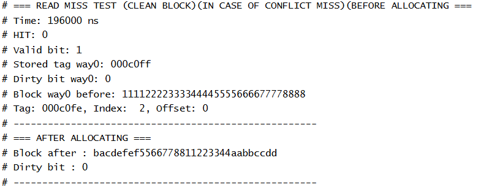
</div>


<div align="center">
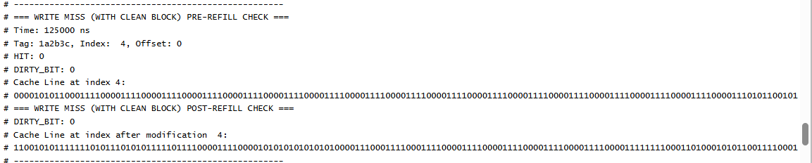
</div>

## Testing of integrated RTL modules:
[modular_integration](https://github.com/ee-uet/configurable-cache/tree/main/Direct_Mapped_Cache/modular_integration)

---
# 2-Way Set-Associative Cache

## 1.Overview

A **2-Way Set-Associative Cache** is a type of cache memory organization that strikes a balance between the simplicity of direct-mapped caches and the flexibility of fully associative caches. In this configuration, the cache is divided into multiple sets, each containing two cache lines. A memory block can be placed in either of the two lines within a set, allowing for more flexible data placement and reducing the likelihood of cache misses compared to direct-mapped caches.

### Structure

- **Cache Division**: The cache is divided into several sets, each containing two cache lines.
- **Address Breakdown**: A memory address is divided into three parts:
  - **Tag**: Identifies the specific block in memory.
  - **Set Index**: Determines which set the data might reside in.
  - **Block Offset**: Specifies the exact location within the cache line.

### Operation

When a memory request is made:

1. The **Set Index** part of the address is used to select a set.
2. Both cache lines within the selected set are checked for a match using the **Tag**.
3. If either line contains the requested data, it's a cache hit; otherwise, it's a miss, and the data is fetched from main memory.

### Comparison with Direct-Mapped Cache

| Feature               | Direct-Mapped Cache           | 2-Way Set-Associative Cache     |
|-----------------------|-------------------------------|---------------------------------|
| Cache Lines per Set    | 1                             | 2                               |
| Placement Flexibility  | Low (fixed mapping)           | Moderate (2 choices per set)    |
| Conflict Misses        | Higher                        | Lower                           |
| Hardware Complexity    | Simpler                       | More complex                    |
| Performance            | May degrade with certain access patterns | Better for a wider range of patterns |

### Benefits Over Direct-Mapped Cache

- **Reduced Conflict Misses**: By allowing two possible locations for each block, the likelihood of conflicts is decreased, leading to a higher cache hit rate.
- **Improved Performance**: Especially beneficial for workloads with access patterns that might cause frequent conflicts in a direct-mapped cache.
- **Balanced Complexity**: Offers a compromise between the simplicity of direct-mapped caches and the complexity of fully associative caches.
## 2- Specifications of Our 2-Way Set Associative Cache:


| **Parameter**        | **Value (from code)** |
|-----------------------|------------------------|
| Word Size            | 32 bits (per word) |
| Words per Block      | 4 words |
| Block Size           | 128 bits (16 bytes per block) |
| Number of Blocks     | 64 (total cache lines across all sets & ways) |
| Associativity        | 2-way (each set holds 2 cache lines) |
| Number of Sets       | 32 sets (NUM_BLOCKS / NUM_WAYS) |
| Cache Size           | 1 KB (64 blocks × 16 bytes = 1024 bytes) |
| Index Bits           | 5 ($clog2(NUM_SETS) = 32 → 5) |
| Block Offset Bits    | 2 ($clog2(WORDS_PER_BLOCK) = 4 → 2) |
| Tag Width            | 25 bits |
| Valid Bit            | 1 per cache line |
| Dirty Bit            | 1 per cache line |
| Replacement Policy   | PLRU (Pseudo-LRU), maintained as a single bit per set |
| Cache Line Format    | {valid (1), dirty (1), tag (25), block (128 bits)} → total 155 bits per cache line |
| Data Storage         | 2D array: `cache[NUM_SETS][2]` (set-indexed, 2 ways per set) |

## 3- Top-Level Diagram (2-Way vs Direct-Mapped):
 Top level diagram almost remains the same, here is the brief overview:
### ***Inputs***:
- **req_type**: 0 = Read, 1 = Write (same as direct-mapped).

- **req_valid**: Indicates CPU request (same).

- **address [31:0]**: Physical address from CPU. (Difference: address now splits into Tag=25 bits, Index=5 bits, Offset=2 bits).

- **data_in [31:0]**: Data from CPU for write requests(same).

- **data_out_mem [127:0]**: 128-bit block from main memory (same).

- **clk, rst**: System clock and reset. 

### ***Outputs***

- **data_out [31:0]**: Word returned to CPU.(same)

- **done_cache:** Request completed.(same)

- **dirty_block_out [127:0]**: Block sent to memory on eviction.(same)

- **hit:** Indicates tag match in either way (different from direct-mapped where only 1 tag check existed).

## **4- Datapath (2-Way Overview)**:
### ***Similarities***:

- CPU sends requests (req_valid, req_type, address, data_in).

- Cache Decoder still splits address into {Tag, Index, Block Offset}.

- Cache Controller FSM still handles Compare → WriteBack → WriteAllocate → RefillDone states.

- Main memory interface unchanged: 128-bit transfers.

### ***Key Differences***:
1- **Tag Comparison:**

Direct-Mapped → 1 tag check per set.

2-Way → two parallel comparators, one for each way.

2- **Cache Storage:**

Direct-Mapped → cache[NUM_SETS] (one line per set).

2-Way → cache[NUM_SETS][2] (two lines per set).

3- **Replacement Policy:**

Direct-Mapped → No replacement needed (fixed slot).

2-Way → Pseudo-LRU (1 bit per set) decides which way to evict.

4- **Hit Signal:**

Direct-Mapped → hit = valid && (tag == stored_tag).

2-Way → hit = (hit_way0 || hit_way1).

## **5- Cache Controller (FSM Brief)**:
The FSM remains almost identical:

- **IDLE** → wait for req_valid.

- **COMPARE** →

   If hit → serve read/write.

   If miss + clean → fetch from memory.

  If miss + dirty → write-back old block.

- **WRITE_BAC**K → send dirty block to memory.

- **WRITE_ALLOCATE** → request new block from memory.

- **REFILL_DONE** → write block into cache, update PLRU, return to CPU.

## **Module-by-Module Explanation**:
### 1-  ***cache_decoder***:
 #### **Inputs:**

- clk, address [31:0]
#### **Outputs:**

- tag [24:0]

- index [4:0]

- blk_offset [1:0]
#### **Function:**
Splits the 32-bit CPU address into:

- tag (upper bits): sent to both way (contains 2 lines → way0 and way1).comparators.

- index (middle bits): selects the set (contains 5 bits to represent 32 sets)

- block offset (lowest bits): selects word within block.

### 2- Cache controller:
Cache controler module is exactly same as direct mapped cache.

### 3- Main Memory Interface:
main memory interface is also exactly the same as direct mapped cache.

### 4- Cache Memory module:
####  ***Inputs***:

- **clk** – system clock  
- **tag [TAG_WIDTH-1:0]** – extracted tag from CPU address  
- **index [INDEX_WIDTH-1:0]** – selects cache set  
- **blk_offset [OFFSET_WIDTH-1:0]** – selects word within block  
- **req_type** – 0 = Read, 1 = Write  
- **read_en_cache** – enables cache read (CPU-side)  
- **write_en_cache** – enables cache write (CPU-side)  
- **read_en_mem** – enables memory read (refill)  
- **write_en_mem** – enables memory write (eviction)  
- **data_in_mem [BLOCK_SIZE-1:0]** – new block from memory  
- **data_in [WORD_SIZE-1:0]** – single word from CPU  
- **refill** – indicates block replacement/refill operation

#### **Outputs**

- **dirty_block_out [BLOCK_SIZE-1:0]** – evicted dirty block (to memory)  
- **hit** – asserted if tag match in any way  
- **data_out [WORD_SIZE-1:0]** – word returned to CPU on read hit  
- **dirty_bit** – indicates dirty block present in current set  

#### **Internal Structures**

- **Cache Line Format** – `{valid, dirty, tag, block_data}`  
- **cache array** – `cache[NUM_SETS][2]` → 2 ways per set  
- **PLRU array** – `plru[NUM_SETS]` → 1-bit replacement info per set  
- **cache_info_t struct (info0, info1)** – Holds per-way signals: valid, dirty, tag, block, hit .
#### ***Functionality***:
##### i- **Hit/Miss Detection**

For each set, the two ways are checked in parallel:

- If the stored tag matches the CPU tag and valid bit = 1, that way asserts a hit.

- If neither way hits, a miss occurs and replacement must be performed. 

 ##### ii- **Replacement Policy – PLRU**

This design uses **Pseudo-LRU (PLRU)** instead of a true LRU to reduce hardware cost.

##### ***How PLRU Works in This Module***:
- Each set has a single **PLRU bit** (`plru[index]`)  
- This bit points to the victim candidate for the next replacement  
- **If `plru[index] = 0` → way-0** will be replaced on a miss  
- **If `plru[index] = 1` → way-1** will be replaced on a miss  
- Whenever a way is accessed (hit or refill), the PLRU bit **flips** to mark the other way as the future victim  

This ensures that the way least recently accessed is always chosen, but with only **1 bit per set** overhead.

##### ***Example Flow***:
1. CPU hits in **way-0** → `plru[index]` is set to `1` (so way-1 is next victim)  
2. Next miss in that set → **way-1** will be evicted  
3. If CPU then hits in **way-1** → `plru[index]` flips back to `0`  

Thus, PLRU approximates LRU but with far less storage.

##### iii-  **Miss Handling**

When a miss occurs:
- If **one way is invalid** → the block is refilled into that empty way  
- If **both are valid** → the PLRU victim way is chosen  
- If the victim is **clean** → directly overwritten  
- If the victim is **dirty** → the dirty block is written to memory first (`dirty_block_out`), then refilled with new data  


#### iv- **Read and Write Operations**

- **On a Read Hit**  
  - The requested word (`blk_offset`) is selected from the block and sent to `data_out`  
  - PLRU is updated to point to the other way  

- **On a Write Hit**  
  - The word is updated in place and marked **dirty**  
  - PLRU flips to mark the other way as next victim  

- **On a Miss**  
  - Memory is accessed, block is refilled, and PLRU is updated accordingly  

---

#### ***Why PLRU is Efficient Here***
- **Low cost** → Just one bit per set vs. full history bits in true LRU  
- **Good approximation** → Ensures alternate ways are reused fairly  
- **Hardware friendly** → Implemented as simple flip logic in always blocks  

✅ This makes **PLRU** the ideal replacement policy for small, low-complexity 2-way associative caches like this one.

## Testbench Documentation for `cache_memory`

### Purpose
The testbench (`cache_tb`) is designed to verify and validate the functionality of the `cache_memory` module.  
It systematically simulates read and write operations across multiple ways of a set-associative cache, verifying:

- Cache hit/miss detection  
- Dirty bit handling (clean vs. dirty evictions)  
- PLRU replacement policy operation during block eviction  
- Correct refill from memory on misses  

---

### 🔌 DUT Interface

#### Inputs
| **Signal**      | **Description** |
|------------------|-----------------|
| `clk`            | Clock signal (10ns period) |
| `tag`            | Tag field of the memory address |
| `index`          | Index selecting a cache set |
| `blk_offset`     | Word offset within the cache block |
| `req_type`       | Operation type: `0 = Read`, `1 = Write` |
| `read_en_cache`  | Read enable signal |
| `write_en_cache` | Write enable signal |
| `refill`         | Asserted to load a block from memory on miss |
| `data_in_mem`    | Full block data input from memory during refill |
| `data_in`        | Word-level data input for write operations |

#### Outputs
| **Signal**        | **Description** |
|--------------------|-----------------|
| `data_out`         | Word read from cache |
| `hit`              | High (`1`) if access is a hit, low (`0`) if miss |
| `dirty_bit`        | Dirty status of the selected cache block |
| `dirty_block_out`  | Block data to be written back to memory when evicted dirty |
| `done_cache`       | Operation done flag (optional) |

---

### ✅ Test Cases

#### 1. Read Hit
- **Setup**: Tag + index matches valid block in cache  
- **Action**: Assert `read_en_cache = 1`  
- **Expected**:  
  - `hit = 1`  
  - Correct `data_out` returned  
  - `dirty_bit` unchanged  
  - PLRU updated  

#### 2. Write Hit
- **Setup**: Matching tag + index entry exists  
- **Action**: Assert `write_en_cache = 1` with valid `data_in`  
- **Expected**:  
  - `hit = 1`  
  - Word updated in cache  
  - `dirty_bit = 1`  
  - PLRU updated  

#### 3. Read Miss (Clean Block in Set)
- **Setup**: Tag mismatch, chosen way is clean  
- **Action**: Trigger `read_en_cache = 1`, then assert `refill`  
- **Expected**:  
  - `hit = 0`  
  - Block replaced with `data_in_mem`  
  - `dirty_block_out` not used  
  - PLRU updated  

#### 4. Read Miss (Dirty Block Eviction)
- **Setup**: All ways valid, victim is dirty  
- **Action**: Assert `read_en_cache = 1`  
- **Expected**:  
  - `hit = 0`  
  - Evicted block on `dirty_block_out`  
  - Refetched data replaces it  
  - PLRU updated  

#### 5. Write Miss (Clean Victim Way)
- **Setup**: Victim way is clean  
- **Action**: Perform write after refill  
- **Expected**:  
  - Initial `hit = 0`  
  - Block refilled + word written  
  - `dirty_bit = 1`  
  - PLRU updated  

#### 6. Write Miss (Dirty Victim Way)
- **Setup**: Victim way is dirty  
- **Action**: Write request triggers eviction  
- **Expected**:  
  - Initial `hit = 0`  
  - `dirty_block_out` carries evicted block  
  - New block refilled + updated with `data_in`  
  - `dirty_bit = 1`  
  - PLRU updated  

#### 7. Compulsory Miss (Invalid Entry)
- **Setup**: Index not yet allocated  
- **Action**: First read to that set  
- **Expected**:  
  - `hit = 0`  
  - Line filled with `data_in_mem`  
  - `dirty_bit = 0`  
  - PLRU initialized  

#### 8. PLRU Replacement Behavior
- **Setup**: Fill all ways, then access subset  
- **Action**: Trigger miss requiring eviction  
- **Expected**:  
  - PLRU selects least-recently used way  
  - After replacement, PLRU state updated  

---

### 🌟 Features of the Testbench
- **Preloaded Cache Content**: Controlled initialization for targeted tests  
- **Cycle-by-Cycle Verification**: Uses `@(posedge clk)` for stepwise operations  
- **Readable Logs**: Shows hit/miss, dirty bit, PLRU victim, and cache state  
- **Waveform-Friendly**: Clear signal transitions for debugging


## Testing of integrated RTL modules:
[modular_integration](https://github.com/ee-uet/configurable-cache/tree/main/2-WAY%20SET_ASSOCIATIVE%20CACHE/modular_integration)


# 4-Way Set-Associative Cache

## 1. Overview

A **4-Way Set-Associative Cache** is a cache memory organization where each set contains four cache lines. Compared to a 2-way set-associative cache, it provides even more placement flexibility, further reducing conflict misses and improving cache hit rates for workloads with frequent memory reuse.

### Structure

- **Cache Division**: The cache is divided into multiple sets, each containing four cache lines.
- **Address Breakdown**: A memory address is divided into three parts:
  - **Tag**: Identifies the specific block in memory.
  - **Set Index**: Determines which set the data might reside in.
  - **Block Offset**: Specifies the exact location within the cache line.

### Operation

When a memory request is made:

1. The **Set Index** part of the address is used to select a set.
2. All four cache lines within the selected set are checked for a match using the **Tag**.
3. If any line contains the requested data, it is a cache hit; otherwise, it is a miss, and the data is fetched from main memory.

### Comparison with 2-Way Set-Associative Cache

| Feature               | 2-Way Set-Associative Cache | 4-Way Set-Associative Cache |
|-----------------------|-----------------------------|-----------------------------|
| Cache Lines per Set    | 2                           | 4                           |
| Placement Flexibility  | Moderate (2 choices per set)| Higher (4 choices per set) |
| Conflict Misses        | Low                         | Lower                       |
| Hardware Complexity    | Moderate                    | Higher                      |
| Performance            | Good for many access patterns| Better for high-conflict access patterns |

### Benefits Over 2-Way Set-Associative Cache

- **Further Reduced Conflict Misses**: More options for placing memory blocks within a set reduces the chance of cache conflicts.
- **Improved Cache Hit Rate**: Especially beneficial for programs with repeated accesses to multiple memory addresses that map to the same set.
- **Better Performance for Complex Workloads**: Handles high-frequency accesses more efficiently without dramatically increasing the cache size.

## 2- Specifications of Our 4-Way Set Associative Cache:


| **Parameter**        | **Value (from code)** |
|-----------------------|------------------------|
| Word Size            | 32 bits (per word) |
| Words per Block      | 4 words |
| Block Size           | 128 bits (16 bytes per block) |
| Number of Blocks     | 64 (total cache lines across all sets & ways) |
| Associativity        | 4-way (each set holds 4 cache lines) |
| Number of Sets       | 16 sets (NUM_BLOCKS / NUM_WAYS) |
| Cache Size           | 1 KB (64 blocks × 16 bytes = 1024 bytes) |
| Index Bits           | 4 ($clog2(NUM_SETS) = 16 → 4) |
| Block Offset Bits    | 2 ($clog2(WORDS_PER_BLOCK) = 4 → 2) |
| Tag Width            | 26 bits |
| Valid Bit            | 1 per cache line |
| Dirty Bit            | 1 per cache line |
| Replacement Policy   | PLRU (Pseudo-LRU), maintained as a single bit per set |
| Cache Line Format    | {valid (1), dirty (1), tag (26), block (128 bits)} → total 156 bits per cache line |
| Data Storage         | 2D array: `cache[NUM_SETS][4]` (set-indexed, 4 ways per set) |

## 3- Top-Level Diagram (4-Way vs Direct-Mapped):
 Top level diagram almost remains the same, here is the brief overview:
### ***Inputs***:
- **req_type**: 0 = Read, 1 = Write (same as direct-mapped).

- **req_valid**: Indicates CPU request (same).

- **address [31:0]**: Physical address from CPU. (Difference: address now splits into Tag=25 bits, Index=5 bits, Offset=2 bits).

- **data_in [31:0]**: Data from CPU for write requests(same).

- **data_out_mem [127:0]**: 128-bit block from main memory (same).

- **clk, rst**: System clock and reset. 

### ***Outputs***

- **data_out [31:0]**: Word returned to CPU.(same)

- **done_cache:** Request completed.(same)

- **dirty_block_out [127:0]**: Block sent to memory on eviction.(same)

- **hit:** Indicates tag match in either way (different from direct-mapped where only 1 tag check existed).

## **4- Datapath (4-Way Overview)**:
### ***Similarities***:

- CPU sends requests (req_valid, req_type, address, data_in).

- Cache Decoder still splits address into {Tag, Index, Block Offset}.

- Cache Controller FSM still handles Compare → WriteBack → WriteAllocate → RefillDone states.

- Main memory interface unchanged: 128-bit transfers.

### ***Key Differences***:
1- **Tag Comparison:**

Direct-Mapped → 1 tag check per set.

2-Way → two parallel comparators, one for each way.

4-Way → four parallel comparators, one for each way.

2- **Cache Storage:**

Direct-Mapped → cache[NUM_SETS] (one line per set).

2-Way → cache[NUM_SETS][2] (two lines per set).

4-Way → cache[NUM_SETS][4] (four lines per set).

3- **Replacement Policy:**

Direct-Mapped → No replacement needed (fixed slot).

2-Way → Pseudo-LRU (1 bit per set) decides which way to evict.

4-Way → Pseudo-LRU (1 bit per set) decides which way to evict.

4- **Hit Signal:**

Direct-Mapped → hit = valid && (tag == stored_tag).

2-Way → hit = (hit_way0 || hit_way1).

4-Way → hit = (hit_way0 || hit_way1 || hit_way2 || hit_way3).

## **5- Cache Controller (FSM Brief)**:
The FSM remains almost identical:

- **IDLE** → wait for req_valid.

- **COMPARE** →

   If hit → serve read/write.

   If miss + clean → fetch from memory.

  If miss + dirty → write-back old block.

- **WRITE_BAC**K → send dirty block to memory.

- **WRITE_ALLOCATE** → request new block from memory.

- **REFILL_DONE** → write block into cache, update PLRU, return to CPU.

## **Module-by-Module Explanation**:
### 1-  ***cache_decoder***:
 #### **Inputs:**

- clk, address [31:0]
#### **Outputs:**

- tag [25:0]

- index [3:0]

- blk_offset [1:0]
#### **Function:**
Splits the 32-bit CPU address into:

- tag (upper bits): sent to all ways (contains 4 lines → way0, way1, way2, way3).comparators.

- index (middle bits): selects the set (contains 4 bits to represent 16 sets)

- block offset (lowest bits): selects word within block.

### 2- Cache controller:
Cache controler module is exactly same as direct mapped cache & 2-way set-associative cache.

### 3- Main Memory Interface:
main memory interface is also exactly the same as direct mapped cache & 2-way set-associative cache.

### 4- Cache Memory module:
####  ***Inputs***:

- **clk** – system clock  
- **tag [TAG_WIDTH-1:0]** – extracted tag from CPU address  
- **index [INDEX_WIDTH-1:0]** – selects cache set  
- **blk_offset [OFFSET_WIDTH-1:0]** – selects word within block  
- **req_type** – 0 = Read, 1 = Write  
- **read_en_cache** – enables cache read (CPU-side)  
- **write_en_cache** – enables cache write (CPU-side)  
- **read_en_mem** – enables memory read (refill)  
- **write_en_mem** – enables memory write (eviction)  
- **data_in_mem [BLOCK_SIZE-1:0]** – new block from memory  
- **data_in [WORD_SIZE-1:0]** – single word from CPU  
- **refill** – indicates block replacement/refill operation

#### **Outputs**

- **dirty_block_out [BLOCK_SIZE-1:0]** – evicted dirty block (to memory)  
- **hit** – asserted if tag match in any way  
- **data_out [WORD_SIZE-1:0]** – word returned to CPU on read hit  
- **dirty_bit** – indicates dirty block present in current set  

#### **Internal Structures**

- **Cache Line Format** – `{valid, dirty, tag, block_data}`  
- **cache array** – `cache[NUM_SETS][4]` → 4 ways per set  
- **PLRU array** – `plru[NUM_SETS]` → 3-bit replacement info per set (tree-based PLRU)
- **cache_info_t struct (info0, info1, info2, info3)** – Holds per-way signals: valid, dirty, tag, block, hit .
#### ***Functionality***:
##### i- **Hit/Miss Detection**

For each set, the four ways are checked in parallel:

- If the stored tag matches the CPU tag and valid bit = 1, that way asserts a hit.

- If neither way hits, a miss occurs and replacement must be performed. 

 ##### ii- **Replacement Policy – PLRU**

This design uses **Pseudo-LRU (PLRU)** instead of a true LRU to reduce hardware cost.

##### ***How PLRU Works in This Module***:
- Each set maintains **3 PLRU bits** (`plru[index].b1`, `plru[index].b2`, `plru[index].b3`).
- These bits form a **binary tree** that encodes the least-recently-used (LRU) way.
- **Victim selection on miss**:
  - `b1` decides which subtree to evict from:
    - `0` → go left subtree (ways 0–1)
    - `1` → go right subtree (ways 2–3)
  - If left subtree chosen:
    - `b2=0` → victim = way-0
    - `b2=1` → victim = way-1
  - If right subtree chosen:
    - `b3=0` → victim = way-2
    - `b3=1` → victim = way-3
- **Update on access (hit or refill)**:
  - When a way is accessed, the tree bits are updated so that this way becomes **most recently used (MRU)**.
  - The tree is flipped to point toward another way as the **next replacement candidate**.

This approximates true LRU with only **3 bits per set**, instead of maintaining full access history.

##### ***Example Flow***:
1. CPU hits in **way-0** → PLRU tree updates (`b1=1, b2=1`) so that way-0 is marked MRU, and another way (way-1 or from the right subtree) becomes the next victim.
2. Next miss in that set → Victim is chosen by traversing the PLRU tree. For example, if `b1=1, b3=0`, then **way-2** will be evicted.
3. If CPU then hits in **way-2** → PLRU tree updates (`b1=0, b3=1`) so that way-2 is MRU, and another way (e.g., way-0, way-1, or way-3) becomes the next victim.

Thus, Tree-PLRU approximates true LRU with only **3 bits per set**, instead of storing full history.

##### iii-  **Miss Handling**

When a miss occurs:
- If **any way is invalid** → the block is refilled into the first invalid way  
- If **all 4 ways are valid** → the PLRU victim way is chosen  
- If the victim is **clean** → it is directly overwritten with the new block  
- If the victim is **dirty** → the dirty block is written back to memory first (`dirty_block_out`), then the new block is refilled into that way


#### iv- **Read and Write Operations**

- #### iv- **Read and Write Operations**

- **On a Read Hit**  
```systemverilog
if (hit) begin
    data_out = cache[set][hit_way].block[blk_offset];  
    // update PLRU for this set
    plru[set] = update_plru(plru[set], hit_way);
end


- **On a Write Hit** 
```systemverilog 
 if (hit) begin
    cache[set][hit_way].block[blk_offset] = data_in;
    cache[set][hit_way].dirty = 1'b1;  
    // update PLRU for this set
    plru[set] = update_plru(plru[set], hit_way);
end
```
- **On a Miss**  
```systemverilog 
  if (miss) begin
    if (exists_invalid_way(set)) begin
        victim_way = get_invalid_way(set);
    end else begin
        victim_way = get_plru_victim(plru[set]);
    end
    
    if (cache[set][victim_way].dirty) begin
        // write back dirty block to memory
        dirty_block_out = cache[set][victim_way].block;
        write_back_to_mem(tag, set, cache[set][victim_way]);
    end
    
    // refill from memory
    cache[set][victim_way].block = read_block_from_mem(address);
    cache[set][victim_way].valid = 1'b1;
    cache[set][victim_way].dirty = is_write ? 1'b1 : 1'b0;

    // update PLRU
    plru[set] = update_plru(plru[set], victim_way);
end
  
```
---

#### ***Why PLRU is Efficient Here***
- **Low cost** → Just one bit per set vs. full history bits in true LRU  
- **Good approximation** → Ensures alternate ways are reused fairly  
- **Hardware friendly** → Implemented as simple flip logic in always blocks  

✅ This makes **PLRU** the ideal replacement policy for small, low-complexity 2-way associative caches like this one.

## Testbench Documentation for `cache_memory`

### Purpose
The testbench (`cache_tb`) is designed to verify and validate the functionality of the `cache_memory` module.  
It systematically simulates read and write operations across multiple ways of a set-associative cache, verifying:

- Cache hit/miss detection  
- Dirty bit handling (clean vs. dirty evictions)  
- PLRU replacement policy operation during block eviction  
- Correct refill from memory on misses  

---

### 🔌 DUT Interface

#### Inputs
| **Signal**      | **Description** |
|------------------|-----------------|
| `clk`            | Clock signal (10ns period) |
| `tag`            | Tag field of the memory address |
| `index`          | Index selecting a cache set |
| `blk_offset`     | Word offset within the cache block |
| `req_type`       | Operation type: `0 = Read`, `1 = Write` |
| `read_en_cache`  | Read enable signal |
| `write_en_cache` | Write enable signal |
| `refill`         | Asserted to load a block from memory on miss |
| `data_in_mem`    | Full block data input from memory during refill |
| `data_in`        | Word-level data input for write operations |

#### Outputs
| **Signal**        | **Description** |
|--------------------|-----------------|
| `data_out`         | Word read from cache |
| `hit`              | High (`1`) if access is a hit, low (`0`) if miss |
| `dirty_bit`        | Dirty status of the selected cache block |
| `dirty_block_out`  | Block data to be written back to memory when evicted dirty |
| `done_cache`       | Operation done flag (optional) |

---

### ✅ Test Cases

#### 1. Read Hit
- **Setup**: Tag + index matches valid block in cache  
- **Action**: Assert `read_en_cache = 1`  
- **Expected**:  
  - `hit = 1`  
  - Correct `data_out` returned  
  - `dirty_bit` unchanged  
  - PLRU updated  

#### 2. Write Hit
- **Setup**: Matching tag + index entry exists  
- **Action**: Assert `write_en_cache = 1` with valid `data_in`  
- **Expected**:  
  - `hit = 1`  
  - Word updated in cache  
  - `dirty_bit = 1`  
  - PLRU updated  

#### 3. Read Miss (Clean Block in Set)
- **Setup**: Tag mismatch, chosen way is clean  
- **Action**: Trigger `read_en_cache = 1`, then assert `refill`  
- **Expected**:  
  - `hit = 0`  
  - Block replaced with `data_in_mem`  
  - `dirty_block_out` not used  
  - PLRU updated  

#### 4. Read Miss (Dirty Block Eviction)
- **Setup**: All ways valid, victim is dirty  
- **Action**: Assert `read_en_cache = 1`  
- **Expected**:  
  - `hit = 0`  
  - Evicted block on `dirty_block_out`  
  - Refetched data replaces it  
  - PLRU updated  

#### 5. Write Miss (Clean Victim Way)
- **Setup**: Victim way is clean  
- **Action**: Perform write after refill  
- **Expected**:  
  - Initial `hit = 0`  
  - Block refilled + word written  
  - `dirty_bit = 1`  
  - PLRU updated  

#### 6. Write Miss (Dirty Victim Way)
- **Setup**: Victim way is dirty  
- **Action**: Write request triggers eviction  
- **Expected**:  
  - Initial `hit = 0`  
  - `dirty_block_out` carries evicted block  
  - New block refilled + updated with `data_in`  
  - `dirty_bit = 1`  
  - PLRU updated  

#### 7. Compulsory Miss (Invalid Entry)
- **Setup**: Index not yet allocated  
- **Action**: First read to that set  
- **Expected**:  
  - `hit = 0`  
  - Line filled with `data_in_mem`  
  - `dirty_bit = 0`  
  - PLRU initialized  

#### 8. PLRU Replacement Behavior
- **Setup**: Fill all ways, then access subset  
- **Action**: Trigger miss requiring eviction  
- **Expected**:  
  - PLRU selects least-recently used way  
  - After replacement, PLRU state updated  

---

### 🌟 Features of the Testbench
- **Preloaded Cache Content**: Controlled initialization for targeted tests  
- **Cycle-by-Cycle Verification**: Uses `@(posedge clk)` for stepwise operations  
- **Readable Logs**: Shows hit/miss, dirty bit, PLRU victim, and cache state  
- **Waveform-Friendly**: Clear signal transitions for debugging  


# Synthesization of RTL:
we synthesized RTL on Vivado to check its compatibility with hardware implementation by analyzing the utilization report.
[synthesis_vivado](https://github.com/ee-uet/configurable-cache/tree/388368cb34323a59cb31c21528f4e31c361c0388/synthesis_vivado)


  


